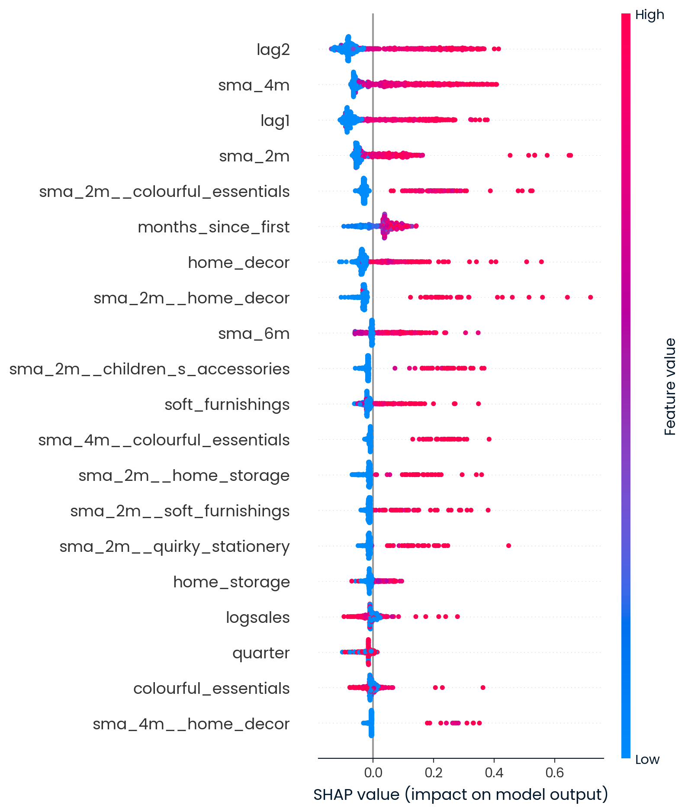

# Explainable AI for Demand Forecasting in E-Commerce (Home Decor)

🔍 **Executive Summary**  
This project explains what drives next-month home décor purchases using explainable machine learning.  
Using SHAP values and two trained models, we identify which customer behaviors most influence buying decisions — helping marketing run smarter campaigns, inventory better plan stock, and strategy create winning bundles.

This project uses **Explainable AI (XAI)** to uncover what drives customers to purchase in the `home_decor` category. By applying **SHAP (Shapley values)** to both a **Random Forest** and **K-Nearest Neighbors (KNN)** model, we identify which features matter most for forecasting next-month demand — making predictions **transparent and actionable** for:

- Marketing
- Inventory Planning
- Strategic Decision-Making

---

## Project Objectives

- Identify top predictors of next-month home decor purchases
- Compare feature importance across two model types (RF & KNN)
- Translate model outputs into business-friendly insights
- Support data-driven actions across marketing and inventory teams

---

## Project Structure

| File | Description |
|------|-------------|
| `model.pkl` | Trained RandomForestRegressor |
| `knn_model.pkl` | Trained KNeighborsRegressor |
| `X_train.csv` | Features used to train models |
| `X_test.csv` | Features used for explanation |
| `y_train.csv` | Labels (home decor sales) – used for model training |
| `y_test.csv` | Labels for evaluation (not needed for SHAP) |
| `shap_summary_plot.png` | SHAP summary plot |
| `explaining_demand_forecasting.ipynb` | Notebook with SHAP implementation and insights |

---

## Methodology

- **Explainability Technique:** SHAP — a model-agnostic approach based on cooperative game theory
- **Models Used:**
  - `RandomForestRegressor` – explained with `TreeExplainer`
  - `KNeighborsRegressor` – explained with `KernelExplainer`
- **Model Consistency Check**:  
  - Metric: **Cosine Similarity** of feature importance rankings  
  - Threshold: **≥ 0.80 = Reliable**  
  - ✅ **Result**: `0.89` → The alignment across models indicates **high confidence in interpretability and model stability**.

---

## Top Predictive Features

| Rank | Feature | Description |
|------|---------|-------------|
| 1 | `lag2` | Home decor purchase 2 months ago |
| 2 | `sma_4m` | 4-month moving average of purchases |
| 3 | `lag1` | Home decor purchase 1 month ago |
| 4 | `sma_2m` | 2-month moving average |
| 5 | `sma_2m__colourful_essentials` | Recent spend in related category (cross-sell signal) |

---

🧠 **Why Trust the Random Forest More?**

While both models agree on top signals (e.g., `lag1`, `lag2`, `sma_4m`), **Random Forest explanations are more reliable** because:

- TreeExplainer uses model internals for accuracy  
- KNN explanations rely on approximations via Kernel SHAP, which can be noisy or unstable with small sample sizes

➡️ **Use Random Forest’s SHAP results for making business decisions.**

---

## 📈 Business Summary Table

| Business Area | SHAP Insight | Action |
|---------------|--------------|--------|
| Marketing     | Recent decor or accessory purchases | Run retargeting ads; trigger email flows |
| Inventory     | Lag-based and moving average demand signals | Pre-stock items with consistent purchase patterns |
| Strategy      | Cross-category interest (e.g., accessories + decor) | Launch bundle promotions; update homepage merchandising |

---

### Business Insights

- **Marketing**: Target users who recently bought decor or similar items
- **Inventory**: Stock planning guided by moving averages and lag trends
- **Strategy**: Cross-sell through category bundles (e.g., Home Decor + Colourful Essentials)

These insights are data-backed and derived from real customer behavior.

---

## SHAP Summary Plot

This plot shows which features most influence the model’s output.  
- 🔴 Red = high feature value (e.g., high past spending) → pushes prediction **up**  
- 🔵 Blue = low feature value → pushes prediction **down**

---

## Tech Stack

- Python 3.10
- SHAP
- scikit-learn
- NumPy, Pandas
- Matplotlib (optional SHAP plot)

---

### Future Work

- Try time-series specific models (e.g., XGBoost + lag features)
- Scale SHAP explanations on full dataset
- Add LIME as an alternate explainer for model comparison
- Integrate insights into CRM dashboard for real-time decision-making

---

## Notes
- The y_train.csv and y_test.csv files are only needed if retraining the model. SHAP doesn't require y values directly.
- Data is sampled for speed — feel free to scale up using full sets.
- For public sharing, redact or mask any sensitive or proprietary data.
